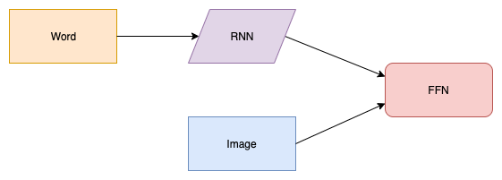

# Image Caption Generation

Caption generation is a challenging artificial intelligence problem where a textual description must be generated for a given photograph.

It requires both methods from computer vision to understand the content of the image and a language model from the field of natural language processing to turn the understanding of the image into words in the right order. Recently, deep learning methods have achieved state-of-the-art results on examples of this problem.

Deep learning methods have demonstrated state-of-the-art results on caption generation problems. What is most impressive about these methods is a single end-to-end model can be defined to predict a caption, given a photo, instead of requiring sophisticated data preparation or a pipeline of specifically designed models.

### Steps:

* Photo and Caption Dataset
* Prepare Photo Data
* Prepare Text Data
* Build Deep Learning Model
* Train Model
* Evaluate Model
* Generate New Captions

### Model 

The Flickr 8k dataset is used for image caption generation, which you can download by filling [this](https://forms.illinois.edu/sec/1713398) form provided by the University of Illinois at Urbana-Champaign. 

This dataset contains 8000 images each with 5 captions

Other Datasets,

* [COCO 2015 Image Captioning](http://cocodataset.org/#captions-2015)
* [Google Conceptual Captions](https://ai.google.com/research/ConceptualCaptions/download)

